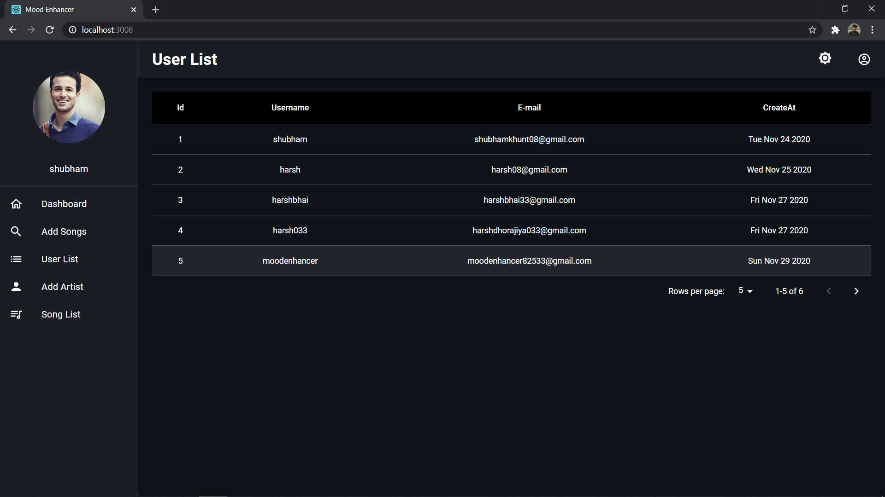

<!-- PROJECT LOGO -->
<br />
<p align="center">
  <a href="https://github.com/sadiqabubakar626/moodEnhancer>
    
  </a>

  <h3 align="center">Mood Enhancer Player</h3>

  <p align="center">
    A web app that helps you to enhance your mood.
    <br />
    <br />

<!-- ABOUT THE PROJECT -->

# Mood Enhancer Player

It is a Full Stack Music player Web App that helps to enhance your mood by playing songs without any ads.
  
## Features

- Caching the data using Apollo-client.
- Like, play, pause, next, previous song.
- Recommend artist and album by user actions.
- Responsive and Dark Mode.
- User can upload his/her profile(AWS S3).
- User can Play only specific artist songs.
- Role-based Backend(user/admin)
- Search song by artist name and song name.
- Register and login using JWT auth.
- User Management(Admin)
- Upload Songs on AWS S3(Admin)
- Chart Based Analysis(Admin)

## Live Demo

[Click Here](https://mymoodyapp.netlify.app) to play around.

## Guest Credentials

```
Email: testuser@gmail.com
Password: test@123
```

# Tech Stack

## Frontend

- [React](https://reactjs.org/)
- [Material-Ui](https://material-ui.com/)
- [Apollo-Client](https://www.apollographql.com/docs/react)
- [Charjs](https://www.chartjs.org)

## Backend

- [GraphQL](https://graphql.org)
- [MongoDB and Mongoose](https://mongoosejs.com/)
- [Apollo-Server](https://www.apollographql.com/docs/apollo-server/)
- [Nodejs](https://nodejs.org/en)
- [Flask](https://flask.palletsprojects.com/en/1.1.x/)

## Cloud Platform for storage

- [AWS S3 bucket](https://docs.aws.amazon.com/AWSCloudFormation/latest/UserGuide/aws-properties-s3-bucket.html)<br/><br/>

# Project WorkFlow

<br/><br/>


# Prerequisites

This is an example of how to list things you need to use the software and how to install them.

- npm
  ```sh
  npm install npm@latest -g
  ```

# Installation

1. Clone the repo
   ```sh
   git clone https://github.com/mood-enhancer-player/mood-enhancer-player-client.git
   ```
2. Install NPM packages
   ```sh
   npm install
   ```
3. Enter your Credential in `config.js`

4. To start development server run 
   ```sh
   npm start
   ```

# Project Screenshot

<br/><br/>

<br/><br/>

<br/><br/>

<br/><br/>

<br/><br/>

<br/><br/>

<br/><br/>

<br/><br/>

<br/><br/>

<br/><br/>

<br/><br/>

<br/><br/>

<br/><br/>

# Admin Panel

<br/><br/>

<br/><br/>

<br/><br/>


<!-- LICENSE -->

## License

Distributed under the MIT License. See `LICENSE` for more information.
